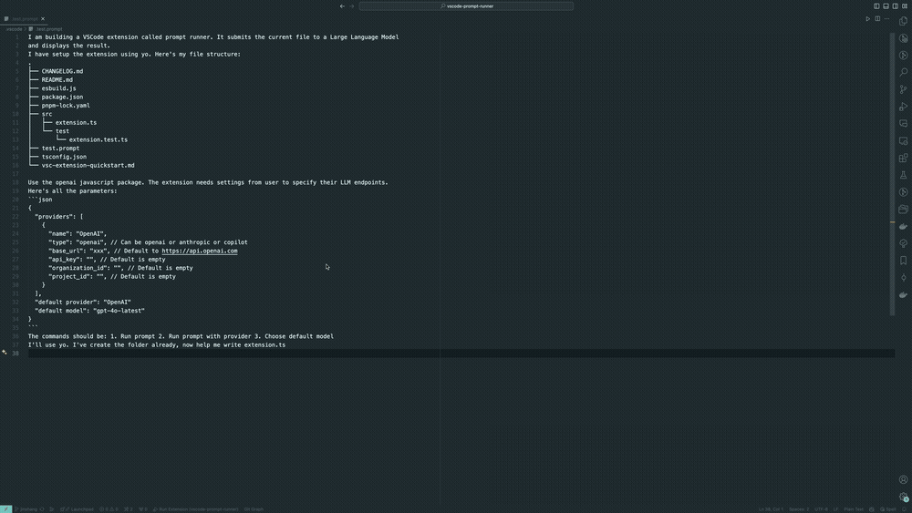

# Prompt Runner VSCode Extension

## Overview

Prompt Runner is a Visual Studio Code extension that allows users to run prompt files against various LLMs directly from the editor. It turns VSCode into a powerful prompt IDE. You no longer have to tolerate the tiny chat interface or copy pasting between apps for complex prompts.



## Installation 

Install on [VSCode Marketplace](https://marketplace.visualstudio.com/items?itemName=JinShang.prompt-runner)

## Features

- **Run Prompts**: Run the content of the active editor as a prompt against the selected LLM provider and model.
- **Streaming Output**: View streaming responses from LLMs in real-time within the VSCode output channel.
- **Custom Configuration**: Configure your own providers, models, and default settings.
- **Multiple Providers**: Support for various providers including OpenAI, Ollama. I am working on Anthropic and VSCode Copilot as model providers.
- **Observability**(TODO): Integrate with Langfuse for observability, feedback and prompt management.

## Usage

### Commands

- **Run Prompt**: Run the current document as a prompt using the default provider and model.
  - Command: `Prompt Runner: Run Prompt`
  
- **Run Prompt with Selected Provider**: Run the current document as a prompt after selecting a provider and model.
  - Command: `Prompt Runner: Run Prompt with Selected Provider`
  
- **Select Default Model**: Set the default provider and model to use for future prompts.
  - Command: `Prompt Runner: Select Default Model`

### Configuration

The extension allows users to configure providers and models in the VSCode settings. If no configuration is provided, the extension will initialize with default settings.

#### Default Providers

The default providers include:
- **OpenAI**: Supports models like `gpt-3.5-turbo`, `gpt-4`, etc.
- **Anthropic**: Includes models such as `claude-3.5-sonnet`, `claude-3-opus`, etc.
- **VSCode Copilot**: Supports several versions of the GPT models provided by VSCode.
- **Ollama**: A locally hosted LLM with support for custom models.

#### Provider Configuration Schema

The configuration for providers can be defined in the VSCode settings file. Currently supported provider types are `openai` and `ollama`. `anthropic` is coming next. Example config:

```json
{
    "prompt-runner.providers": [
        {
            "name": "OpenAI",
            "type": "openai",
            "base_url": "https://api.openai.com/v1", // So that you can use OpenAI-compatible servers
            "api_key": "<your-api-key>",
            "models": [
                "gpt-3.5-turbo",
                "gpt-4",
                "gpt-4o",
                "gpt-4o-mini"
            ],
            "default_model": "gpt-4o",
            "organization_id": "",
            "project_id": ""
        }
    ]
}
```

### Manual Compilation

1. Clone this repository or download the source code.
2. Install the necessary dependencies using `npm` or `yarn`:
   ```bash
   npm install
   ```
   or
   ```bash
   yarn install
   ```
3. Open the project in Visual Studio Code.
4. Press `F5` to launch the extension in a new VSCode window for testing and development.

## Development

TODO

## Contribution

Contributions are welcome! Please fork the repository, make your changes, and submit a pull request.

## License

This project is licensed under the MIT License.
